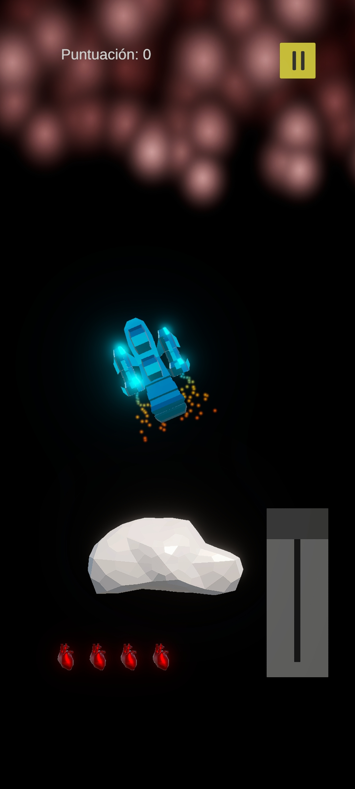
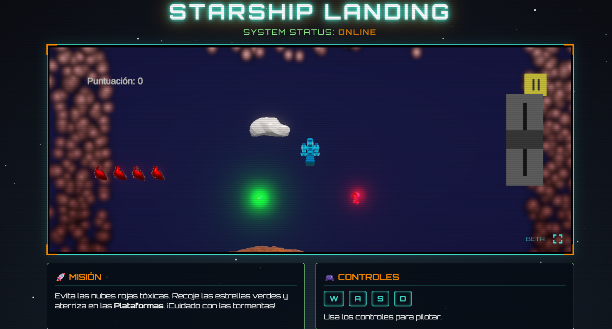

# Starship Landing [BETA]

**"El espacio es implacable. El aterrizaje es la parte más difícil."**

Este repositorio aloja la beta jugable de mi videojuego de simulación espacial. El objetivo principal del proyecto fue crear una experiencia desafiante basada en físicas reales, donde la inercia y la gravedad juegan un papel fundamental en la jugabilidad.

Utilizo **Unity** exportado a WebGL para el motor del juego, envuelto en una interfaz web inmersiva creada con HTML5 y CSS3.

## Tech Stack

* **Motor:** Unity (C#) & WebGL.
* **Web Wrapper:** HTML5, CSS3 y JavaScript.
* **Estilo:** Low-Poly Retro-Futurista.

---

## Mecánicas de Vuelo: Físicas y Gravedad
No es un arcade convencional. He diseñado el sistema de movimiento para que el jugador sienta el peso de la nave. Debes gestionar el impulso de los propulsores principales contra la gravedad del planeta, utilizando los retro propulsores para maniobras de precisión.

---

## Estética: Interfaz de Mando Inmersiva
Para aumentar la inmersión, el juego no se ejecuta en una ventana simple, sino dentro de una "cabina" diseñada con código web. La estética combina el Low-Poly con efectos de monitor antiguo y luces de neón.

---

## Manual de Vuelo (Controles)
El objetivo es posar la nave suavemente en las plataformas.

| Acción | Tecla |
| :--- | :---: |
| **Propulsor Principal** | `W` / `⬆️` |
| **Virar Izquierda** | `A` / `⬅️` |
| **Virar Derecha** | `D` / `➡️` |
| **Estabilizar** | `S` / `⬇️` |

## Juega Ahora
La beta es jugable directamente desde el navegador (No requiere instalación):
* [ **JUGAR A STARSHIP LANDING**](https://daicaluc.github.io/StarshipLanding_Beta/)

## Contacto
* [LinkedIn](linkedin.com/in/danicasadomanza)
* [Email](mailto:danicasadomanza@gmail.com)
